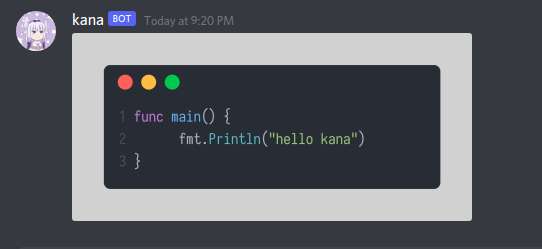

<h2><p align="center"><b>kana</b></p></h2>
<p align="center"> </p>
<p align="center">discord bot for generate code snippet on the fly, made with <a href="https://github.com/teknologi-umum/graphene/">graphene</a></p>

### Invite kana to your sever
<a href="https://discord.com/api/oauth2/authorize?client_id=925229987366314074&permissions=44032&scope=bot%20applications.commands">

</a>

### bot command
```
./code func main() {
      fmt.Println("hello kana")      
}
```

### generated image


### credits
- <b><a href="https://github.com/teknologi-umum/graphene/">graphene</a></b>


